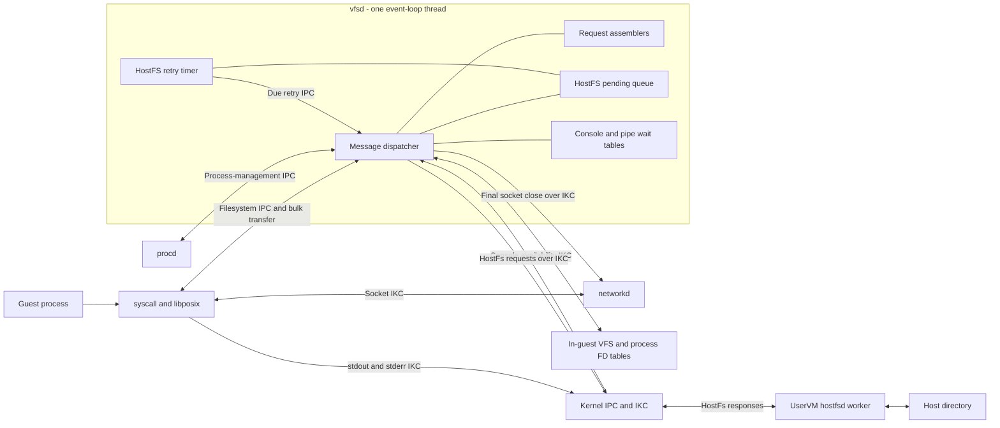
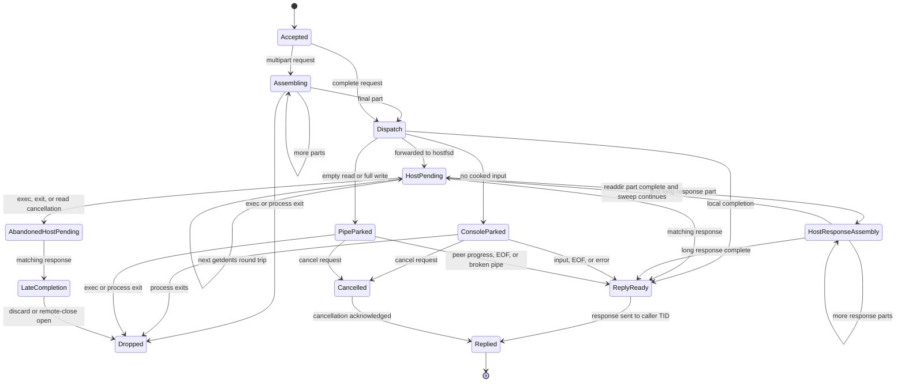
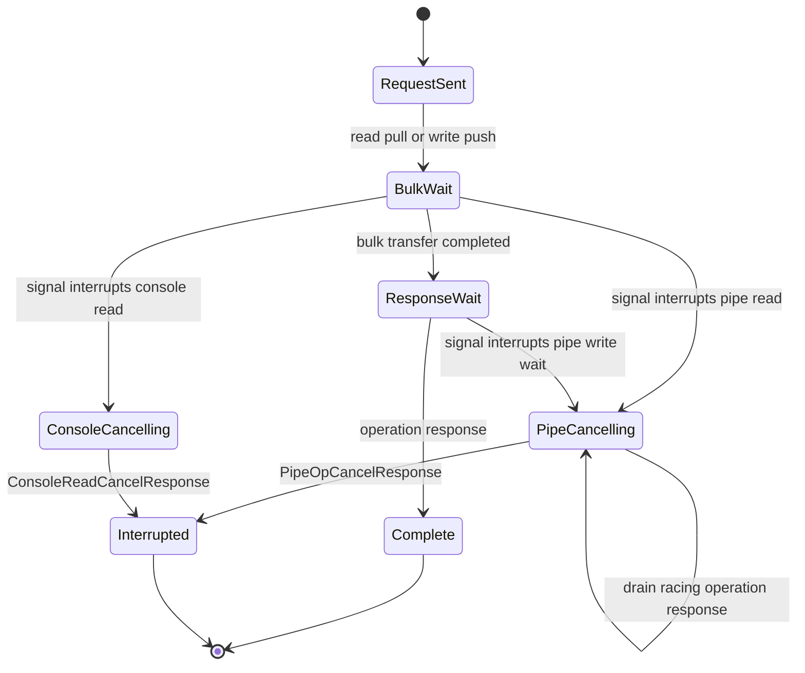
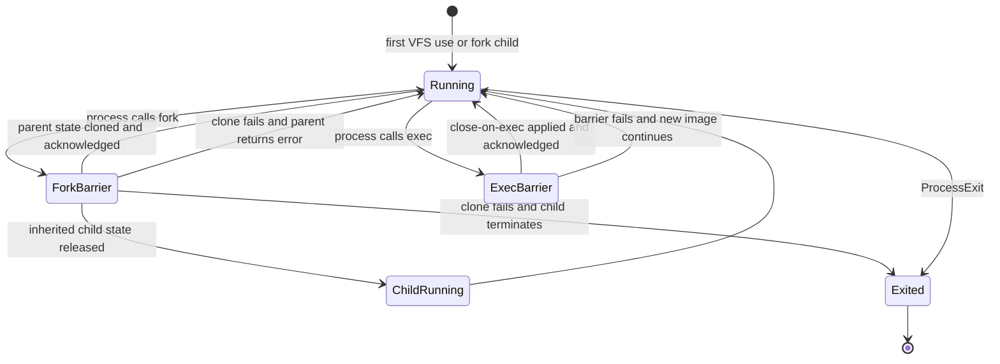

# Virtual Filesystem Daemon (vfsd)

The virtual filesystem daemon (`vfsd`) is the guest-side authority for filesystem process state.
It owns the mapping from each process to its file descriptors and current working directory, runs
local VFS operations, forwards host filesystem operations, and coordinates blocking console and
pipe I/O without blocking its main receive loop.

This document describes the implementation in
[`src/daemons/vfsd`](../../src/daemons/vfsd/src/main.rs). It focuses on the daemon architecture,
the protocols used at its boundaries, and the state machines observed by clients.

## Responsibilities

`vfsd` is responsible for:

- Initializing the in-guest VFS and mounting the root filesystem image at `/`.
- Maintaining per-process file descriptor, working-directory, and creation-mask state.
- Serving local filesystem, descriptor, pipe, terminal, and readiness operations.
- Routing `/mnt` and paths below it to the host filesystem daemon (`hostfsd`) once it is
  explicitly mounted.
- Tracking deferred HostFS requests until their IKC responses arrive.
- Parking and reviving blocking console and pipe operations.
- Cloning and reclaiming filesystem state on fork, exec, and process exit.
- Tracking socket descriptors in the flat descriptor table and forwarding final endpoint closes to
  `networkd`.

Normal socket I/O is handled directly by `networkd`. Standard output and standard error writes are
normally sent directly to the kernel host-I/O path. These data paths bypass `vfsd`, although their
descriptors are still represented in its descriptor table.

## Architecture



The event loop is deliberately single-threaded. This makes the VFS current-process selector and
the daemon's static bulk-transfer buffers safe to use without locks. A helper thread owns only the
HostFS read-retry deadline map and sends due retries to the event-loop thread; it never receives
process IPC or accesses VFS state. HostFS operations and blocked device operations are recorded as
state and completed by later messages instead of waiting in a nested receive loop.

## Startup and Event Loop

Startup in [`main.rs`](../../src/daemons/vfsd/src/main.rs) proceeds as follows:

1. Read the daemon PID and attempt to initialize the VFS.
2. Acquire the I/O-management capability long enough to map the `RAMFS   ` MMIO region.
3. Attempt to mount either the `ROOTFS` entry of a multi-image or a legacy single image at `/`.
4. Send a signup request to `procd`.
5. Wait for `SignupResponse`, buffering guest IPC that arrives before signup completes.
6. Send a one-way `ConsoleInputSubscribe` IKC request.
7. Start the HostFS read-retry timer thread.
8. Create the request assemblers, HostFS pending queue, and console and pipe wait tables.
9. Dispatch the buffered IPC and enter the main receive loop.

Root-image initialization failures are logged and startup continues. Failure to send the console
subscription is fatal, but the subscription has no acknowledgement; a later host-side registration
failure is visible only in UserVM logs.

The main loop receives every message through `__kcall_recv()` and dispatches by transport:

- `MessageType::Ipc` carries guest system calls and trusted process-management messages.
- `MessageType::Ikc` carries HostFS responses, console notifications, and acknowledgements for
  fire-and-forget I/O.
- Other message types are unexpected and are logged and ignored.

Only a `Shutdown` process-management message from `procd` terminates the loop. HostFS and console
work is completed in this same loop, so no operation may wait synchronously for a HostFS response
or for terminal or pipe readiness.

## Module Map

| Module            | Responsibility                                                     |
| :---------------- | :----------------------------------------------------------------- |
| `main.rs`         | Startup, state allocation, and the IPC/IKC event loop.             |
| `init.rs`         | VFS initialization and root image mounting.                        |
| `ipc.rs`          | Sender identity, protocol parsing, dispatch, and process events.   |
| `assembler.rs`    | Assembly and dispatch of multipart guest requests.                 |
| `handler/`        | Local operations and routing to pipes, consoles, HostFS, and poll. |
| `hostfs.rs`       | HostFS path classification and IKC request encoding.               |
| `pending.rs`      | HostFS operation correlation and response completion.              |
| `console_wait.rs` | FIFO of parked console readers and retry state.                    |
| `pipe_wait.rs`    | Per-pipe FIFOs of parked readers and writers.                      |
| `networkd.rs`     | Best-effort forwarding of final socket endpoint closes.            |
| `error.rs`        | VFS error translation and response construction.                   |

## State Ownership

The daemon keeps protocol state separate from filesystem object state:

| State                 | Key               | Contents and purpose                                    |
| :-------------------- | :---------------- | :------------------------------------------------------ |
| VFS process registry  | PID               | Descriptor slots, cwd, umask, and table generation.     |
| Request assemblers    | `(PID, TID, header, request ID)` | One multipart guest request.                |
| HostFS pending queue  | `OperationId`     | Caller PID/TID, operation kind, and its buffered state. |
| Pipe wait table       | Stable pipe ID    | FIFO readers, FIFO writers, and read-retry marker.      |
| Console wait table    | Global FIFO       | Blocked reads, input token, and delivery-retry marker.  |
| Long HostFS responses | One slot per kind | In-progress readlink or readdir response stream.        |

Pipe bytes and endpoint reference counts live in the VFS library, not in the wait table. File
descriptor slots reference shared open-file descriptions, so duplicated and inherited descriptors
share offsets and backend objects. The caller PID selects the process table; the caller TID selects
the exact thread mailbox and bulk-transfer endpoint.

Before dispatching most guest requests, `vfsd` binds the VFS library to the kernel-stamped caller
PID. Deferred HostFS completions and parked console or pipe revivals restore their saved PID because
another client's request may have changed the selector. `ResolveFdRequest` is the payload-PID
exception described below.

## Common Message Protocol

### Envelope and Addressing

Every exchange starts with a fixed-size `Message` from the `sys` crate. Its important fields are:

- `message_type`: selects IPC, IKC, or another kernel message path.
- `source`: a `(PID, TID)` identity.
- `destination`: the destination process and, for replies, the destination thread.
- `status`: zero on success or an `ErrorCode` on failure.
- `payload`: a fixed-size protocol payload.

For guest IPC, the kernel stamps `source` while sending. `vfsd` normally treats the source PID as
the authoritative process-state key and the source TID as the reply target. `ResolveFdRequest` is
an exception: it carries a PID in its payload, and its handler selects that PID's descriptor table
for the route-cache query.

Guest filesystem payloads contain a `SystemCallMessage`:

```text
+-------------------------+----------------+------------------------+
| SystemCallMessageHeader | Request ID     | Operation payload      |
+-------------------------+----------------+------------------------+
```

The header determines how the remainder is decoded. The 32-bit request ID is allocated
monotonically per client thread and echoed in every response part. Unknown headers and malformed
messages receive `InvalidMessage`. Successful and error replies copy the requesting PID and TID;
the exact TID controls mailbox routing.

Client receive helpers wait for the active request ID and expected daemon source. A response for
another active request is placed in a bounded per-thread stash, while an inactive ID is logged and
dropped as stale. This permits a signal handler to run a nested RPC without consuming the response
that belongs to the interrupted call.

### Single-Message RPC

Most descriptor operations fit in one request and one response. Examples include `close`, `dup2`,
`lseek`, `fsync`, `ftruncate`, `fcntl`, descriptor metadata changes, pipe creation, and socket
registration. A handler either returns a response immediately or records deferred state and returns
no message.

Positioned reads and writes (`pread` and `pwrite`) are also single-message exchanges: their data
travels inline in the message payload rather than through a bulk transfer, so they are bounded by
the fixed payload size.

Operations with a larger response, including `fstat`, `getcwd`, and `getdents`, still use a
single-message request but return response parts.

### Multipart RPC

Variable-length requests use `SystemCallMessagePart` framing:

```text
+-------------+-------------+--------------+----------------------+
| total_parts | part_number | payload_size | part payload         |
+-------------+-------------+--------------+----------------------+
```

The client sends parts numbered from zero. `vfsd` stores them in an assembler keyed by caller PID,
caller TID, request header, and request ID. Once complete, it deserializes and dispatches the
logical request. Assembly errors discard that stream and return `InvalidMessage`.

Multipart guest requests cover:

- Path operations: `openat`, `renameat`, `unlinkat`, `mkdirat`, `chdir`, `faccessat`, `symlinkat`,
  `linkat`, and `readlinkat`.
- Path metadata operations: `fstatat`, `utimensat`, `fchownat`, and `fchmodat`.
- `mount`, `umount`, and `poll`.

Multipart responses use the same framing for `fstat`, `fstatat`, `getcwd`, `getdents`,
`readlinkat`, and `poll`. A client sends all request parts before waiting and receives response
parts until the declared `total_parts` is complete.

Incomplete assemblers have no timeout, but their count is bounded. At capacity, `vfsd` evicts one
incomplete stream and answers it with `NoBufferSpace`; exec and process exit purge streams owned by
the affected process.

### Bulk Read and Write

Read and write data is transferred separately from metadata so it can span the fixed message
payload. Reads use page-bounded chunks and stop on a short result. Writes use scatter/gather-bounded
chunks and continue after positive short writes. Each chunk performs one protocol exchange;
HostFS further caps each exchange to its inline read or write capacity.

Guest-vfsd bulk rendezvous carry the same request ID as their metadata message. The kernel matches
on source TID, destination TID, and request ID, so a signal handler's nested transfer cannot consume
the interrupted operation's data. Clients block catchable signals between sending metadata and
registering the tagged transfer; the kernel atomically restores the previous signal mask after the
transfer becomes visible to vfsd. Initial daemon handshakes are bounded, and deferred deliveries
use nonblocking probes so an interrupted caller cannot stall the daemon event loop.

A read exchange is ordered as follows:

1. Client sends `ReadRequest(fd, count)`.
2. Client calls `__kcall_pull()` and waits for `vfsd` to push bytes.
3. `vfsd` pushes data, EOF as an empty transfer, or an empty transfer before an error.
4. Client receives `ReadResponse` and verifies that its count matches the bytes pulled.

A write exchange reverses the bulk direction:

1. Client sends `WriteRequest(fd, count)`.
2. Client pushes the bytes and `vfsd` pulls them.
3. `vfsd` writes or parks the operation.
4. Client receives `WriteResponse`.

For an accepted exchange, the data transfer precedes the metadata response. In particular, every
read error must first push an empty buffer; otherwise the client would remain blocked in
`__kcall_pull()` and never see the error response.

Terminal control (`tcgetattr`, `tcsetattr`, and window-size queries) uses the same bulk mechanism
to move the `termios` and `winsize` structures, and follows the same ordering rule: a failed *get*
releases the caller with an empty push before its error response.

## Protocol Families

### Local VFS Protocol

Local path and descriptor operations are executed against the in-guest VFS selected by the caller
PID. The handler layer translates VFS errors to `ErrorCode`, constructs the operation-specific
response, and sends it to the caller TID. The root process's standard console descriptors are
seeded lazily before its first VFS-visible operation; children inherit those slots during fork.

`ResolveFdRequest` exposes the route, backend descriptor, and descriptor-table epoch used by the
client-side route cache. Descriptor-table mutations update the epoch so clients can invalidate
stale routes. Unlike ordinary dispatch, this handler selects the process table using the PID in the
request payload.

### HostFS Protocol

HostFS forwarding is disabled at boot. A client enables it with
`mount("", "/mnt", "hostfs", 0)`. While enabled, `/mnt` and paths below it are routed to
`hostfsd`; other paths remain local. `umount("/mnt")` disables new path routing.

HostFS requests use `MessageType::Ikc` and the `hostfs-api` encoding. A single-message request has
this logical layout:

```text
+-------------------------+----------------+------------------------+
| HostFs request header   | OperationId    | Operation payload      |
+-------------------------+----------------+------------------------+
```

The forwarding flow is:

1. Check that the pending queue has capacity.
2. Allocate an `OperationId` and encode it into the request.
3. Send the IKC request and retain a `PendingOp` before returning to the event loop.
4. Match the IKC response by `OperationId`.
5. Rebind the VFS to the saved PID when required, apply descriptor-state changes, and reply to the
  saved TID.

Most handlers send first and insert the pending record immediately afterward. This is race-free
only because the event loop is single-threaded and cannot process the response until the handler
returns. Close reserves its pending entry before sending and removes it if the send fails.

The protocol supports open, close, read, write, seek, flush, truncate, mkdir, rmdir, unlink,
rename, stat variants, symlink, readlink, and directory iteration. Variable-length HostFS path
requests use the same multipart framing as guest long messages, with the operation ID at the start
of the assembled body.

`getdents` is a multi-round-trip operation. `hostfsd` returns one directory entry for each
`HostFsReadDirRequest`; `vfsd` retains the pending operation, appends the entry, and sends another
request with the same operation ID until the requested count or end-of-directory is reached.
Long readlink targets and long directory-entry names arrive as multipart response streams.

Single-message responses are checked against the operation kind stored in `PendingOp`. Long
readdir responses also require a pending `Getdents` operation. Long readlink responses are matched
by operation ID only, and their completion path asserts that the pending kind is `Readlink`.

The pending queue is limited to 64 operations. Operation ID zero is reserved for
`FIRE_AND_FORGET`, which is used for cleanup closes that have no waiting client. Responses for that
ID are discarded. Exec, process exit, and interrupted HostFS reads move pending IDs into an
abandoned set until their late responses drain. A successful late open is closed remotely; other
late responses are discarded. Live pending operations still have no timeout, so mounting HostFS
without a running host-side worker can leave callers blocked indefinitely.

### Console Protocol

At startup, `vfsd` sends a console-input subscription. The kernel later sends
`ConsoleInputAvailable` over IKC. Notifications are accepted only from the kernel sender.

A console read follows this service-side protocol:

1. Queue the reader by caller PID/TID, descriptor, and requested byte count.
2. If cooked input or EOF is already buffered, try to serve the FIFO head immediately.
3. Otherwise leave the client blocked in its bulk pull and return to the event loop.
4. On an input notification, send `PollInputRequest` to fetch an immediate raw-input snapshot.
5. Run the terminal line discipline, echo bytes through host I/O, and forward generated terminal
   signals to `procd`.
6. Push cooked bytes or EOF to the reader, then send `ReadResponse`.

Nonblocking reads receive `TryAgain` when no cooked data is ready. A revive uses a zero-duration
push so a client that has not registered its pull cannot stall the event loop. In that race,
`vfsd` sends itself `ConsoleReadRetry` and tries again after yielding.

If a signal interrupts the client's pull, the client sends `ConsoleReadCancelRequest`. `vfsd`
removes reads for that PID/TID and returns `ConsoleReadCancelResponse`, which the client drains
before reporting interruption.

### Pipe Protocol

Pipe contents and endpoint counts live in the VFS. `PipeWaitTable` adds the suspend/revive state
needed for blocking I/O and is keyed by a stable, non-recycled pipe ID.

- An empty blocking read with writers still open is queued in the pipe's reader FIFO.
- A full blocking write is queued in the writer FIFO after `vfsd` has pulled and retained its data.
- A complementary read or write runs `rebalance`, alternating writer and reader wakeups until no
  further progress is possible.
- Closing the last writer drains buffered data and then wakes readers with EOF.
- Closing the last reader fails parked writers with `BrokenPipe`.
- `O_NONBLOCK` returns `TryAgain` instead of parking.

Reader revival uses a zero-duration push and peeks before consuming pipe bytes. If the reader has
not registered its pull yet, `vfsd` preserves the bytes, sends itself `PipeReadRetry`, and retries
through the event loop.

When a signal interrupts a parked pipe operation, the client sends `PipeOpCancelRequest`. The
daemon removes operations matching the kernel-attested PID/TID and request ID, then returns
`PipeOpCancelResponse`, including the number of write bytes already accepted. A normal completion
may race with cancellation, so the client drains matching `ReadResponse` or `WriteResponse`
messages until it receives the cancellation acknowledgement.

### Process-Management Protocol

Process-management messages are nested under `SystemMessageHeader::ProcessManagement`. Only IPC
whose kernel-stamped source PID is `PROCD` can enter the state-mutating handler.

| Message          | Effect in `vfsd`                                                                 |
| :--------------- | :------------------------------------------------------------------------------- |
| `SignupResponse` | Completes daemon registration during startup.                                    |
| `ForkClone`      | Attempts to clone cwd, umask, and descriptors except `FD_CLOFORK`, then replies. |
| `Exec`           | Purges old-image waits and closes `FD_CLOEXEC` descriptors, then acknowledges.   |
| `ProcessExit`    | Reclaims process state and backends, purges waits, then wakes peers.             |
| `Shutdown`       | Leaves the receive loop and exits the daemon.                                    |

Fork and exec acknowledgements are synchronization barriers. `procd` does not release the affected
processes until `vfsd` reports the outcome. A failed fork clone aborts the fork; an exec barrier
failure lets the already-replaced image continue on a best-effort basis. Last-reference HostFS and
socket descriptors found during exec or exit are closed with fire-and-forget messages. Pipe
endpoint closures trigger the same EOF and broken-pipe wakeups as an explicit close. The relay
request ID is echoed in each acknowledgement, so a stale acknowledgement cannot complete a newer
barrier for the same process.

Exec and process exit purge incomplete request assemblers, pending HostFS operations, and parked
console and pipe operations for the affected process.

`vfsd` also sends fire-and-forget terminal-access and terminal-signal notifications to `procd` for
job-control policy and delivery.

### Network Descriptor Protocol

Socket creation and data I/O remain `networkd` operations. Once a socket endpoint exists, a
`RegisterSocketRequest` adds its backend descriptor to `vfsd`'s flat descriptor table so generic
operations such as `dup2`, fork, exec, and close have consistent lifetime semantics.

When the final reference disappears, `vfsd` sends an IKC `CloseRequest` to `networkd`. This close
is best effort and fire-and-forget; the event loop recognizes and discards the later
`CloseResponse`.

## Client State Machines

### Framed RPC Client

This state machine models ordinary, multipart, and bulk-transfer calls from the client thread's
point of view.

```mermaid
stateDiagram-v2
    [*] --> Idle
    Idle --> SendingRequest: syscall starts
    SendingRequest --> SendingRequest: send another request part
    SendingRequest --> BulkTransfer: read, write, or tty data
    SendingRequest --> WaitingReply: request is complete
    BulkTransfer --> WaitingReply: bulk handshake completes
    WaitingReply --> ReceivingParts: first response part
    ReceivingParts --> ReceivingParts: receive another part
    ReceivingParts --> Complete: final part
    WaitingReply --> Complete: single response
    WaitingReply --> SendingRequest: successful chunk; more buffer remains
    Complete --> [*]
```



An ordinary client thread has one synchronous operation, but a signal handler may nest another
operation on the same thread. Request IDs distinguish their responses, and the per-thread matcher
stashes an outer response while the nested operation waits. Whether `vfsd` completes locally,
waits for HostFS, or parks on a device is hidden behind `WaitingReply`.

### Service State for One Client Operation

This state machine expands the daemon states hidden by the client's wait.



Only the assembler, HostFS pending queue, and wait tables retain client operations between
event-loop iterations. A local handler must either produce a response or deliberately transfer
ownership to one of those stores.

### Interruptible Console and Pipe I/O



The cancellation request is a second RPC on the same TID with its own request ID. Its receive loop
matches only the cancellation ID; a racing response for the original operation is stashed for the
outer token. Once cancellation resolves, the caller either returns interruption or drains the
original response. HostFS reads can also be marked abandoned by cancellation, while other deferred
HostFS operations currently have no cancellation protocol.

### Process Filesystem State



Fork copies cwd, umask, and descriptor slots except those marked `FD_CLOFORK`, while sharing open
file descriptions. Exec preserves the process table but removes close-on-exec slots. Both exec and
exit drop parked console and pipe requests from threads that no longer exist; exit also removes the
process table and performs last-reference backend cleanup. Both paths purge multipart assemblers
and move pending HostFS IDs into abandoned tracking until any late responses drain.

## Error Handling and Invariants

The common protocol paths rely on the following invariants:

- IPC source PID and TID are kernel-attested; `ResolveFdRequest` is the payload-PID exception.
- Every guest request and response part carries the same request ID.
- Every guest-vfsd bulk transfer uses that request ID as its rendezvous tag.
- Multipart assembler identity includes PID, TID, header, and request ID.
- The event loop remains single-threaded; current-process selection and static buffers depend on it.
- Read data or an empty read transfer is delivered before its response metadata.
- Single-shot HostFS and parked-I/O completions restore the saved caller PID.
- HostFS responses carry an operation ID; single-message responses validate the recorded kind.
- Only `procd` may mutate process lifecycle state.
- Only `vfsd` may submit internal console and pipe retry messages.

Malformed guest messages return `InvalidMessage`. Local VFS errors are translated to the nearest
`ErrorCode`. A mismatched single-message HostFS response fails that operation with `IoErr`; a
failed HostFS read also sends an empty bulk transfer to release the client. A full HostFS pending
queue rejects new work with `ResourceBusy`.

Most runtime failures are logged and isolated to one request so the daemon can continue. Startup
failures in essential identity, signup, or sending the console subscription are fatal.

## Current Limits

- Incomplete guest multipart requests have no timeout, although they are bounded and purged on
  exec and process exit.
- Live pending HostFS operations have no timeout, and operations other than reads have no signal
  cancellation. Abandoned operations retain queue capacity until their late responses drain.
- A HostFS mount can be enabled without proving that the host-side worker exists.
- IKC sends can block if the kernel queue is full, even though response waiting is asynchronous.
- Parallelizing `vfsd` requires replacing the global VFS process selector and static bulk buffers.

## Source Guide

- [Daemon startup and event loop](../../src/daemons/vfsd/src/main.rs)
- [IPC dispatch and process events](../../src/daemons/vfsd/src/ipc.rs)
- [Multipart request assembly](../../src/daemons/vfsd/src/assembler.rs)
- [HostFS request encoding](../../src/daemons/vfsd/src/hostfs.rs)
- [HostFS pending operations](../../src/daemons/vfsd/src/pending.rs)
- [Console wait state](../../src/daemons/vfsd/src/console_wait.rs)
- [Pipe wait state](../../src/daemons/vfsd/src/pipe_wait.rs)
- [Read and write handlers](../../src/daemons/vfsd/src/handler/readwrite.rs)
- [Pipe handlers](../../src/daemons/vfsd/src/handler/pipe.rs)
- [Guest read client](../../src/libs/syscall/src/unistd/syscall/read.rs)
- [Guest write client](../../src/libs/syscall/src/unistd/syscall/write.rs)
- [HostFS wire types](../../src/libs/hostfs-api/src/lib.rs)
- [VFS implementation](../../src/libs/vfs/src/lib.rs)
